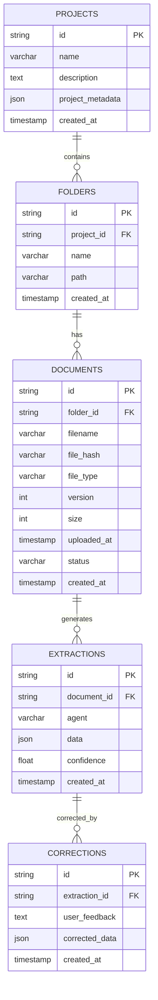

# Construction Analysis API v2.0 🏗️

[](https://fastapi.tiangolo.com/)
[](https://www.sqlalchemy.org/)
[](https://www.postgresql.org/)

> **📋 Latest Audit Report Available!**  
> Comprehensive audit completed on 2025-10-03. See [COMPREHENSIVE_AUDIT_REPORT.md](COMPREHENSIVE_AUDIT_REPORT.md) for detailed findings and [AUDIT_CHECKLIST.md](AUDIT_CHECKLIST.md) for action items.
>
> **System Readiness:** 75% (improved from 60% after P0+P1 fixes)  
> **Test Coverage:** 40% (8 contract tests passing)  
> **Status:** ✅ Core functionality working with orchestrator integration

## 🚀 Features

- **Database Storage**: PostgreSQL with SQLAlchemy ORM and Alembic migrations
- **Multi-file Upload**: Support for simultaneous upload of multiple files
- **ZIP Support**: Automatic extraction and processing of ZIP archives
- **Self-learning Corrections**: AI agents learn from user feedback
- **Document Versioning**: File versioning with SHA256 hash comparison
- **JSON Diff**: Deep comparison of document extraction results
- **Backward Compatibility**: All existing endpoints remain functional

## 📊 Database Schema



## 🔧 API Endpoints

### New Database-Powered Endpoints

#### Projects
- `POST /api/projects` - Create project
- `GET /api/projects` - List projects  
- `GET /api/projects/{id}` - Project details

#### Upload & Documents
- `POST /api/projects/{id}/upload` - Multi-file upload with ZIP support
- `GET /api/projects/{id}/documents` - List documents
- `GET /api/projects/{id}/documents/{doc_id}` - Document metadata
- `GET /api/projects/{id}/documents/{doc_id}/download` - Download file

#### Extractions
- `POST /api/projects/{id}/documents/{doc_id}/extract` - Run agents manually
- `GET /api/projects/{id}/documents/{doc_id}/extractions` - List results
- `GET /api/extractions/{id}` - Extraction details

#### Corrections (Self-learning)
- `POST /api/extractions/{id}/correction` - Save user correction
- `GET /api/extractions/{id}/corrections` - List corrections

#### Compare
- `GET /api/projects/{id}/compare?doc1=UUID&doc2=UUID` - Compare documents
- `GET /api/projects/{id}/compare/concrete?doc1=UUID&doc2=UUID` - Compare concrete analysis
- `GET /api/extractions/{id1}/compare/{id2}` - Compare extractions

### Legacy Endpoints (Backward Compatible)
- `POST /analyze/concrete` - Concrete analysis
- `POST /analyze/materials` - Materials analysis  
- `POST /compare/docs` - Document comparison
- `POST /compare/smeta` - Smeta comparison
- `POST /upload/files` - Simple file upload

---

## 🌐 Production URLs and CORS

- Frontend (prod): https://stav-agent.onrender.com  
- Backend (prod): https://concrete-agent.onrender.com

### Frontend env
Set the backend base URL (Render → frontend service → Environment):
- Vite: `VITE_API_URL=https://concrete-agent.onrender.com`
- Next.js: `NEXT_PUBLIC_API_URL=https://concrete-agent.onrender.com`

Frontend must use absolute API URL from env (see `frontend/src/lib/api.ts`).

### Backend CORS
Set allowed origins (Render → backend service → Environment):
```
ALLOWED_ORIGINS=https://stav-agent.onrender.com,http://localhost:3000,http://127.0.0.1:3000,http://localhost:5173,http://127.0.0.1:5173
```
FastAPI reads `ALLOWED_ORIGINS` and configures `CORSMiddleware`.

Подробнее см. [docs/DEPLOYMENT.md](docs/DEPLOYMENT.md).

---

## 🧪 Testing

### Running Tests

```bash
# Install test dependencies
pip install pytest pytest-asyncio httpx

# Run all tests
pytest tests/ -v

# Run specific test file
pytest tests/test_upload_contract.py -v

# Run with coverage
pytest tests/ --cov=app --cov-report=html
```

### Test Coverage

**Current:** 40% (8 contract tests)
- ✅ Upload endpoint contract verification
- ✅ File type validation
- ✅ Size limit enforcement (50MB)
- ✅ Multi-file upload support
- ✅ Error handling
- ✅ Response structure validation

**Test Files:**
- `tests/test_upload_contract.py` - Upload API contract tests (8 tests)

---

## 📚 Documentation

- **[COMPREHENSIVE_AUDIT_REPORT.md](COMPREHENSIVE_AUDIT_REPORT.md)** - Complete system audit (850+ lines)
- **[AUDIT_CHECKLIST.md](AUDIT_CHECKLIST.md)** - Actionable tasks and priorities
- **[AUDIT_VISUAL_SUMMARY.md](AUDIT_VISUAL_SUMMARY.md)** - Quick reference guide
- **[TZD_READER_README.md](TZD_READER_README.md)** - TZD Reader agent documentation
- **[502_FIX_SUMMARY.md](502_FIX_SUMMARY.md)** - Deployment fixes summary

---

## 🤝 Contributing

1. Check [AUDIT_CHECKLIST.md](AUDIT_CHECKLIST.md) for prioritized tasks
2. Run tests before submitting: `pytest tests/ -v`
3. Ensure code follows existing patterns
4. Update documentation if needed
