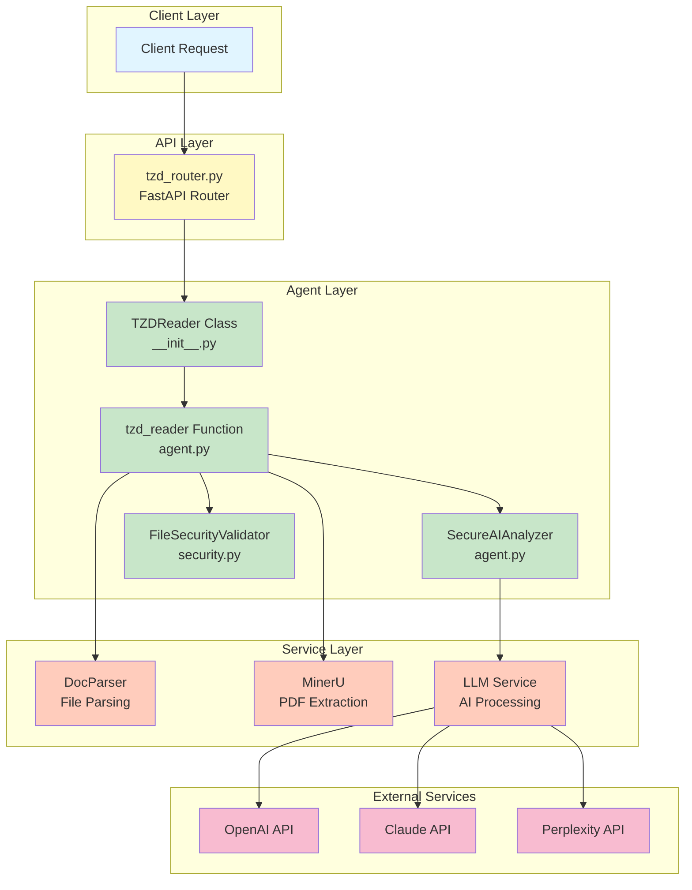
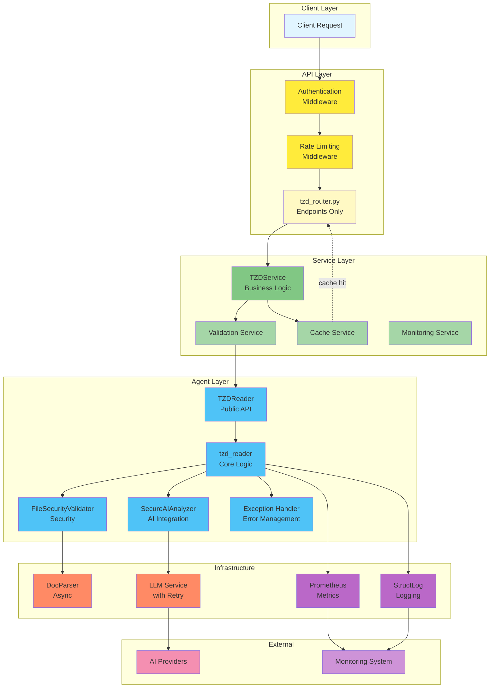
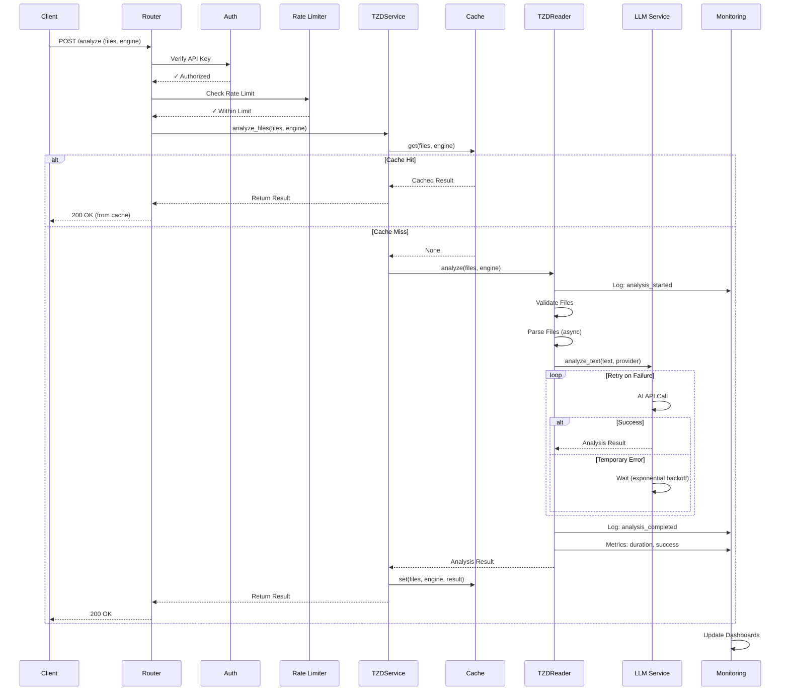
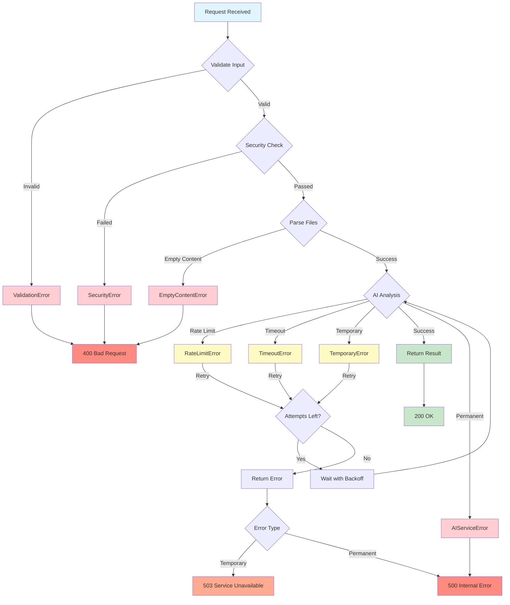
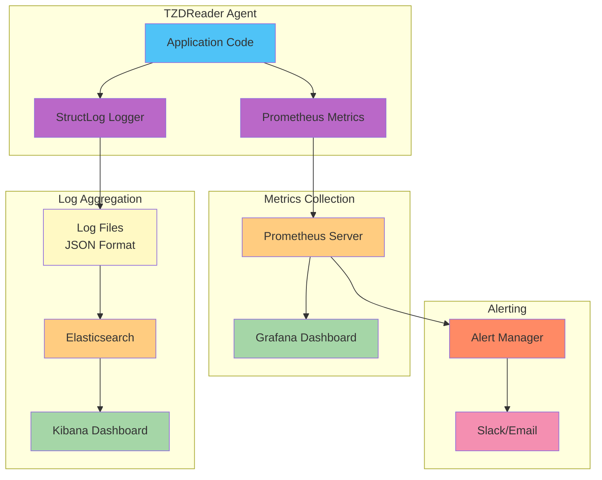
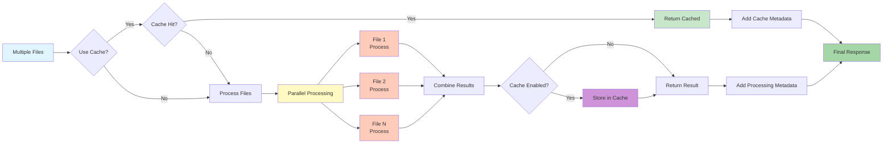
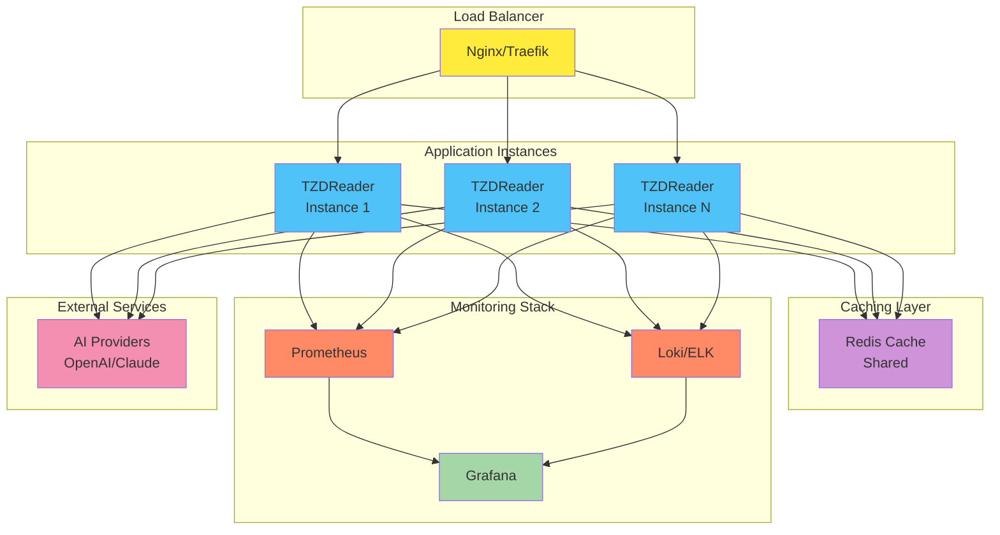

# TZDReader Architecture Diagrams

## Current Architecture

## Improved Architecture (Recommended)

## Request Flow with Improvements

## Error Handling Flow

## Monitoring Architecture

## Performance Optimization Flow

## Deployment Architecture

## Legend

### Component Colors
- 🔵 **Blue** - Core Application Components
- 🟡 **Yellow** - API/Gateway Layer
- 🟢 **Green** - Business Logic/Services
- 🟣 **Purple** - Infrastructure (Logging, Metrics)
- 🟠 **Orange** - External Dependencies
- 🔴 **Red** - Errors/Alerts
- 🌸 **Pink** - Third-party Services

### Connection Types
- **Solid Line** (→) - Synchronous call
- **Dashed Line** (-->) - Asynchronous/Optional
- **Dotted Line** (...>) - Cache hit path
