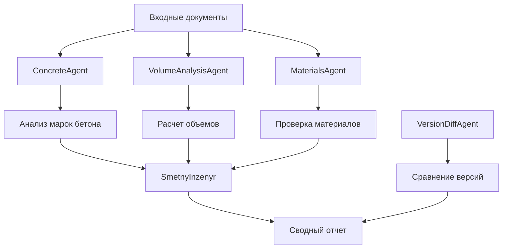

# 📚 Руководство пользователя Concrete Agent

Полное руководство по использованию системы анализа бетона и строительных материалов.

---

## 📋 Содержание

1. [Описание системы](#1-описание-системы)
2. [Установка и настройка](#2-установка-и-настройка)
3. [Запуск системы](#3-запуск-системы)
4. [Работа с API](#4-работа-с-api)
5. [Агенты системы](#5-агенты-системы)
6. [Загрузка и анализ данных](#6-загрузка-и-анализ-данных)
7. [Выходные данные](#7-выходные-данные)
8. [Тестирование](#8-тестирование)
9. [Рекомендации по использованию](#9-рекомендации-по-использованию)
10. [Дополнительно](#10-дополнительно)

---

## 1. Описание системы

### 🎯 Основное назначение

**Concrete Agent** — это интеллектуальная система на базе LLM для автоматического анализа строительной документации. Система предназначена для:

- **Анализа бетона**: извлечение марок бетона и мест их применения из проектной документации
- **Анализа материалов**: обработка спецификаций материалов и их соответствия нормативам
- **Сравнения смет и версий**: сопоставление различных версий документов и смет
- **Объемного анализа**: расчет объемов материалов на основе проектной документации

### 🚀 Основные возможности

- 📄 **Многоформатная обработка документов**: `.PDF`, `.DOCX`, `.DOC`, `.TXT`
- 📊 **Анализ смет**: `.XLS`, `.XLSX`, `.CSV`, `.XML`
- 🔎 **Извлечение марок бетона**: B20, C25/30, C30/37 XF4 и другие
- 🏗 **Определение применения**: где именно используются конкретные марки бетона
- 📋 **Проверка соответствия**: сверка проектной документации со сметами
- 📤 **Структурированные отчеты**: JSON, CSV, PDF форматы
- 🧠 **ИИ-анализ**: использование Claude AI для улучшения точности
- 🔄 **SSRL**: внутренний цикл проверки для повышения качества результатов

### 📁 Поддерживаемые типы данных

#### Входные документы:
- **PDF**: проектная документация, чертежи, спецификации
- **DOCX/DOC**: технические задания, описания проектов
- **TXT**: текстовые файлы с техническими данными
- **XLS/XLSX**: сметы, калькуляции, таблицы материалов
- **CSV**: структурированные данные, экспорты из систем
- **XML**: структурированные сметы и спецификации

#### Максимальные лимиты:
- Размер файла: **50 МБ**
- Количество документов за запрос: **10 файлов**
- Поддерживаемые кодировки: UTF-8, Windows-1251, CP1252

---

## 2. Установка и настройка

### 📋 Системные требования

- **Python**: 3.9 или выше
- **ОС**: Linux, macOS, Windows
- **ОЗУ**: минимум 4 ГБ, рекомендуется 8 ГБ
- **Дисковое пространство**: 2 ГБ для системы + место для файлов

### 🔧 Установка системы

#### Шаг 1: Клонирование репозитория

```bash
git clone https://github.com/alpro1000/concrete-agent.git
cd concrete-agent
```

#### Шаг 2: Создание виртуального окружения

```bash
# Создание виртуального окружения
python -m venv venv

# Активация (Linux/macOS)
source venv/bin/activate

# Активация (Windows)
venv\Scripts\activate
```

#### Шаг 3: Установка зависимостей

```bash
pip install -r requirements.txt
```

#### Шаг 4: Проверка установки

```bash
python -c "from app.main import app; print('✅ Установка успешна')"
```

### ⚙️ Настройка переменных окружения

#### Создание файла конфигурации

Скопируйте шаблон конфигурации:

```bash
cp .env.template .env
```

#### Настройка `.env` файла

```bash
# === Claude API (обязательно для ИИ-функций) ===
ANTHROPIC_API_KEY=your_anthropic_api_key_here
CLAUDE_MODEL=claude-3-sonnet-20240229
USE_CLAUDE=true

# === Настройки логирования ===
LOG_LEVEL=INFO

# === Лимиты файлов ===
MAX_FILE_SIZE=52428800   # 50 МБ
MAX_DOCUMENTS=10

# === Директории ===
UPLOAD_DIR=uploads
LOGS_DIR=logs

# === Поддерживаемые расширения ===
ALLOWED_EXTENSIONS=.pdf,.docx,.doc,.txt,.xml,.xls,.xlsx,.csv

# === Дополнительные настройки ===
ENVIRONMENT=production
DEBUG=false
```

#### Получение API ключа Claude

1. Зарегистрируйтесь на [console.anthropic.com](https://console.anthropic.com)
2. Создайте новый API ключ
3. Скопируйте ключ в переменную `ANTHROPIC_API_KEY`

⚠️ **Важно**: Без API ключа Claude система будет работать в ограниченном режиме.

### 📁 Создание рабочих директорий

```bash
mkdir -p uploads logs outputs examples
```

---

## 3. Запуск системы

### 🚀 Запуск API сервера

#### Локальный запуск для разработки

```bash
uvicorn app.main:app --reload --host 0.0.0.0 --port 8000
```

#### Запуск для продакшена

```bash
gunicorn app.main:app -w 4 -k uvicorn.workers.UvicornWorker --bind 0.0.0.0:8000
```

#### Запуск с настройками

```bash
# С указанием порта
uvicorn app.main:app --port 8080

# С логированием
uvicorn app.main:app --log-level info --access-log

# Для внешнего доступа
uvicorn app.main:app --host 0.0.0.0 --port 8000
```

### ✅ Проверка работоспособности

#### 1. Проверка статуса API

```bash
curl http://localhost:8000/health
```

Ожидаемый ответ:
```json
{
  "status": "healthy",
  "timestamp": "2025-09-24T12:00:00Z",
  "uptime": "running"
}
```

#### 2. Проверка основных эндпоинтов

```bash
curl http://localhost:8000/
```

#### 3. Проверка документации API

Откройте в браузере: `http://localhost:8000/docs`

### 🐳 Запуск через Docker (опционально)

```bash
# Сборка образа
docker build -t concrete-agent .

# Запуск контейнера
docker run -p 8000:8000 -e ANTHROPIC_API_KEY=your_key concrete-agent
```

---

## 4. Работа с API

### 📊 Обзор доступных эндпоинтов

| Эндпоинт | Метод | Описание | Параметры |
|----------|-------|----------|-----------|
| `/` | GET | Информация о системе | - |
| `/health` | GET | Проверка работоспособности | - |
| `/status` | GET | Подробный статус системы | - |
| `/docs` | GET | Документация API | - |
| `/analyze/concrete` | POST | Анализ бетона | files |
| `/analyze/materials` | POST | Анализ материалов | files |
| `/compare/docs` | POST | Сравнение документов | files |
| `/compare/smeta` | POST | Сравнение смет | files |
| `/upload/files` | POST | Загрузка файлов | files |

### 🔍 Детальное описание эндпоинтов

#### 1. Анализ бетона - `/analyze/concrete`

**Описание**: Основной эндпоинт для анализа марок бетона в документации.

**Параметры**:
- `docs`: список файлов документации (обязательно)
- `smeta`: файл сметы (опционально)

**Пример запроса через cURL**:

```bash
curl -X POST "http://localhost:8000/analyze/concrete" \
  -H "Content-Type: multipart/form-data" \
  -F "docs=@project_docs.pdf" \
  -F "docs=@specifications.docx" \
  -F "smeta=@budget.xlsx"
```

**Пример запроса через Python**:

```python
import requests

url = "http://localhost:8000/analyze/concrete"
files = {
    'docs': [
        ('project_docs.pdf', open('project_docs.pdf', 'rb')),
        ('specifications.docx', open('specifications.docx', 'rb'))
    ],
    'smeta': ('budget.xlsx', open('budget.xlsx', 'rb'))
}

response = requests.post(url, files=files)
result = response.json()
print(result)
```

#### 2. Анализ материалов - `/analyze/materials`

**Описание**: Анализ спецификаций материалов и их соответствия.

```bash
curl -X POST "http://localhost:8000/analyze/materials" \
  -F "docs=@materials_spec.pdf" \
  -F "docs=@technical_requirements.docx"
```

#### 3. Сравнение документов - `/compare/docs`

**Описание**: Сравнение различных версий документов.

```bash
curl -X POST "http://localhost:8000/compare/docs" \
  -F "docs=@version_1.pdf" \
  -F "docs=@version_2.pdf"
```

#### 4. Загрузка файлов - `/upload/files`

**Описание**: Простая загрузка файлов для последующей обработки.

```bash
curl -X POST "http://localhost:8000/upload/files" \
  -F "files=@document.pdf" \
  -F "files=@spreadsheet.xlsx"
```

### 📝 Примеры использования с Postman

#### Настройка Postman для работы с API

1. **Создайте новую коллекцию** "Concrete Agent API"

2. **Добавьте переменную окружения**:
   - `base_url`: `http://localhost:8000`

3. **Создайте запрос для анализа бетона**:
   - Метод: `POST`
   - URL: `{{base_url}}/analyze/concrete`
   - Body: `form-data`
   - Добавьте файлы: ключ `docs`, тип `File`

#### Пример коллекции Postman

```json
{
  "info": {
    "name": "Concrete Agent API",
    "schema": "https://schema.getpostman.com/json/collection/v2.1.0/"
  },
  "item": [
    {
      "name": "Health Check",
      "request": {
        "method": "GET",
        "url": "{{base_url}}/health"
      }
    },
    {
      "name": "Analyze Concrete",
      "request": {
        "method": "POST",
        "url": "{{base_url}}/analyze/concrete",
        "body": {
          "mode": "formdata",
          "formdata": [
            {
              "key": "docs",
              "type": "file",
              "src": "/path/to/your/document.pdf"
            }
          ]
        }
      }
    }
  ]
}
```

---

## 5. Агенты системы

Система Concrete Agent использует модульную архитектуру с специализированными агентами для разных типов анализа.

### 🤖 Основные агенты

#### 1. ConcreteAgent (`agents/concrete_agent.py`)

**Назначение**: Извлечение и анализ марок бетона

**Функции**:
- Извлечение марок бетона из документов (B20, C25/30, C30/37 XF4, и т.д.)
- Определение мест применения каждой марки
- Сопоставление с техническими требованиями
- Проверка соответствия нормативам

**Входные данные**: PDF, DOCX документы с техническими спецификациями

**Выходные данные**: JSON с марками бетона и их применением

#### 2. VolumeAnalysisAgent (`agents/volume_agent/`)

**Назначение**: Анализ объемов материалов

**Функции**:
- Расчет объемов бетона по проектной документации
- Извлечение данных из výkaz výměr (ведомостей объемов)
- Сопоставление расчетных и фактических объемов
- Валидация объемных расчетов

#### 3. MaterialsAgent (`agents/materials_agent.py`)

**Назначение**: Анализ строительных материалов

**Функции**:
- Извлечение спецификаций материалов
- Проверка соответствия стандартам
- Анализ технических характеристик
- Выявление несоответствий в документации

#### 4. SmetnyInzenyr (`agents/smetny_inzenyr/`)

**Назначение**: Анализ смет и калькуляций

**Функции**:
- Обработка сметной документации
- Извлечение позиций и расценок
- Анализ состава работ
- Проверка корректности калькуляций

#### 5. VersionDiffAgent (`agents/version_diff_agent.py`)

**Назначение**: Сравнение версий документов

**Функции**:
- Сравнение различных версий проектов
- Выявление изменений в документации
- Анализ влияния изменений на смету
- Отслеживание истории изменений

### 🔄 Взаимодействие агентов



### ⚙️ Настройка агентов

#### Конфигурация через переменные окружения

```bash
# Режим работы Claude
CLAUDE_MODE=enhancement  # или primary

# Модель Claude
CLAUDE_MODEL=claude-3-sonnet-20240229

# Язык обработки документов
DEFAULT_LANGUAGE=cz  # или en, ru

# Включение/отключение агентов
USE_VOLUME_AGENT=true
USE_MATERIALS_AGENT=true
USE_DIFF_AGENT=true
```

#### Программная настройка

```python
from agents.concrete_agent import get_hybrid_agent

# Получение настроенного агента
agent = get_hybrid_agent()

# Анализ с настройками
result = await agent.analyze(
    doc_paths=['document1.pdf', 'document2.pdf'],
    smeta_path='budget.xlsx',
    use_claude=True,
    claude_mode='enhancement',
    language='ru'
)
```

---

## 6. Загрузка и анализ данных

### 📤 Процесс загрузки файлов

#### Через веб-интерфейс (API)

1. **Подготовка файлов**:
   - Убедитесь, что файлы имеют поддерживаемые расширения
   - Проверьте размер файлов (максимум 50 МБ)
   - При необходимости конвертируйте файлы в поддерживаемые форматы

2. **Загрузка через API**:
```python
import requests

# Подготовка файлов
files = {
    'docs': [
        ('project.pdf', open('project.pdf', 'rb')),
        ('specs.docx', open('specs.docx', 'rb'))
    ]
}

# Отправка запроса
response = requests.post(
    'http://localhost:8000/analyze/concrete',
    files=files
)

result = response.json()
```

#### Через командную строку

```bash
# Базовый анализ
python analyze_concrete_complete.py --docs project.pdf specs.docx

# Анализ со сметой
python analyze_concrete_complete.py \
  --docs project.pdf specs.docx \
  --smeta budget.xlsx

# Анализ с настройками языка
python analyze_concrete_complete.py \
  --docs *.pdf \
  --language ru \
  --output results/
```

### 🔍 Процесс анализа данных

#### Этапы анализа

1. **Предварительная обработка**:
   - Валидация входных файлов
   - Извлечение текста из документов
   - Нормализация кодировок

2. **Первичный анализ**:
   - Классификация типа документа
   - Извлечение структурированных данных
   - Выявление ключевых разделов

3. **Специализированная обработка**:
   - Анализ марок бетона
   - Расчет объемов материалов
   - Проверка соответствия нормативам

4. **ИИ-обработка** (при включенном Claude):
   - Дополнительная валидация результатов
   - Улучшение точности извлечения данных
   - Контекстуальный анализ

5. **Формирование отчета**:
   - Объединение результатов всех агентов
   - Структурирование данных
   - Генерация выходных форматов

#### Мониторинг процесса

```python
# Отслеживание статуса через логи
import logging

logging.basicConfig(level=logging.INFO)
logger = logging.getLogger(__name__)

# Логи будут показывать прогресс:
# INFO - 📄 Загружен документ: project.pdf
# INFO - 🔍 Начат анализ марок бетона
# INFO - 🧠 Запущен Claude для улучшения результатов
# INFO - ✅ Анализ завершен успешно
```

### 📊 Примеры типовых анализов

#### 1. Анализ проектной документации

**Входные данные**:
- Проектная документация (PDF)
- Спецификации материалов (DOCX)
- Смета (XLSX)

**Процесс**:
```bash
python analyze_concrete_complete.py \
  --docs architectural_plans.pdf structural_plans.pdf specifications.docx \
  --smeta detailed_budget.xlsx \
  --language ru \
  --output project_analysis/
```

**Ожидаемые результаты**:
- Список всех марок бетона в проекте
- Места применения каждой марки
- Объемы материалов
- Сопоставление с сметой

#### 2. Сравнение версий проекта

**Входные данные**:
- Версия 1 проекта (PDF)
- Версия 2 проекта (PDF)

**Процесс**:
```python
import requests

response = requests.post(
    'http://localhost:8000/compare/docs',
    files={
        'docs': [
            ('project_v1.pdf', open('project_v1.pdf', 'rb')),
            ('project_v2.pdf', open('project_v2.pdf', 'rb'))
        ]
    }
)
```

#### 3. Анализ только объемов (без ИИ)

```bash
python analyze_concrete_complete.py \
  --docs volume_statement.pdf \
  --smeta quantities.xlsx \
  --no-claude \
  --language en
```

---

## 7. Выходные данные

### 📋 Форматы отчетов

Система генерирует отчеты в нескольких форматах для различных целей использования.

#### 1. JSON формат (основной)

**Файл**: `outputs/concrete_analysis_report.json`

**Структура**:
```json
{
  "success": true,
  "analysis_timestamp": "2025-01-20T10:30:00Z",
  "analysis_method": "hybrid_claude_enhancement",
  "language": "ru",
  "input_files": {
    "documents": ["project.pdf", "specs.docx"],
    "smeta": "budget.xlsx"
  },
  "concrete_summary": [
    {
      "grade": "C25/30",
      "locations": ["фундамент", "колонны"],
      "volume_m3": 150.5,
      "specifications": {
        "strength_class": "C25/30",
        "exposure_class": "XC1",
        "consistency_class": "S3"
      },
      "smeta_match": {
        "found_in_budget": true,
        "budget_volume": 150.0,
        "variance_percent": 0.33
      }
    }
  ],
  "volume_analysis": {
    "total_concrete_volume": 450.8,
    "by_grade": {
      "C25/30": 150.5,
      "C30/37": 200.3,
      "C35/45": 100.0
    }
  },
  "quality_metrics": {
    "confidence_score": 0.92,
    "data_completeness": 0.88,
    "validation_checks_passed": 15,
    "validation_checks_total": 17
  }
}
```

#### 2. CSV формат

**Файл**: `outputs/concrete_grades_summary.csv`

```csv
Grade,Location,Volume_m3,Strength_Class,Exposure_Class,Budget_Match,Budget_Volume,Variance_%
C25/30,фундамент,150.5,C25/30,XC1,true,150.0,0.33
C30/37,стены,200.3,C30/37,XF2,true,200.0,0.15
C35/45,балки,100.0,C35/45,XC2,false,0,100.0
```

#### 3. PDF отчет

**Файл**: `outputs/concrete_analysis_detailed_report.pdf`

**Содержание**:
- Титульная страница с общей информацией
- Исполнительное резюме
- Детальный анализ по маркам бетона
- Таблицы объемов и спецификаций
- Графики и диаграммы
- Рекомендации и замечания

#### 4. Excel отчет

**Файл**: `outputs/concrete_analysis_workbook.xlsx`

**Листы**:
- `Summary`: общая сводка
- `Concrete_Grades`: детализация по маркам
- `Volumes`: объемный анализ
- `Budget_Comparison`: сравнение со сметой
- `Issues`: выявленные проблемы

### 📊 Интерпретация результатов

#### Показатели качества анализа

- **Confidence Score** (0-1): общая уверенность в результатах
  - 0.9-1.0: очень высокая точность
  - 0.8-0.9: высокая точность
  - 0.7-0.8: средняя точность
  - <0.7: низкая точность, требуется проверка

- **Data Completeness** (0-1): полнота извлеченных данных
  - 1.0: все данные извлечены
  - 0.8-0.99: большинство данных извлечено
  - <0.8: значительная часть данных могла быть пропущена

#### Статусы соответствия смете

- `true`: марка найдена в смете
- `false`: марка не найдена в смете
- `partial`: частичное соответствие
- `unknown`: невозможно определить

#### Уровни отклонений объемов

- **< 5%**: нормальное отклонение
- **5-15%**: умеренное отклонение, требует внимания
- **> 15%**: значительное отклонение, требует проверки

### 📈 Примеры анализа результатов

#### Пример успешного анализа

```json
{
  "success": true,
  "quality_metrics": {
    "confidence_score": 0.94,
    "data_completeness": 0.91
  },
  "concrete_summary": [
    {
      "grade": "C30/37 XF4",
      "locations": ["наружные стены", "колонны"],
      "volume_m3": 285.7,
      "smeta_match": {
        "found_in_budget": true,
        "variance_percent": 2.1
      }
    }
  ]
}
```

**Интерпретация**: Высококачественный анализ с минимальными отклонениями.

#### Пример анализа с проблемами

```json
{
  "success": true,
  "quality_metrics": {
    "confidence_score": 0.73,
    "data_completeness": 0.65
  },
  "issues": [
    {
      "type": "missing_data",
      "description": "Не удалось извлечь объемы для марки C40/50",
      "severity": "medium"
    },
    {
      "type": "budget_mismatch",
      "description": "Марка C25/30 не найдена в смете",
      "severity": "high"
    }
  ]
}
```

**Интерпретация**: Требуется дополнительная проверка документов и ручная корректировка.

---

## 8. Тестирование

### 🧪 Типы тестов в системе

#### 1. Модульные тесты

**Расположение**: `tests/`

**Запуск всех тестов**:
```bash
python -m pytest tests/ -v
```

**Запуск конкретного теста**:
```bash
python -m pytest tests/test_concrete_agent.py -v
```

**Запуск с покрытием кода**:
```bash
python -m pytest tests/ --cov=agents --cov-report=html
```

#### 2. Интеграционные тесты

**Тестирование API**:
```bash
python -m pytest tests/test_api_integration.py -v
```

**Тестирование Claude интеграции**:
```bash
python tests/test_claude_integration.py
```

#### 3. Системные тесты

**Полная проверка системы**:
```bash
python test_system.py
```

Ожидаемый вывод:
```
=== ДИАГНОСТИКА СИСТЕМЫ ===
✅ analyze_concrete_complete.py найден
✅ utils/volume_analyzer.py
✅ utils/report_generator.py
✅ utils/czech_preprocessor.py
✅ Права на запись в outputs/
✅ Функция analyze_concrete_with_volumes доступна
✅ Специализированные агенты доступны
```

### 🔧 Настройка тестовой среды

#### Создание тестовых данных

```bash
# Создание директории для тестов
mkdir -p tests/test_data/

# Копирование примеров документов
cp examples/sample_inputs/* tests/test_data/
```

#### Настройка переменных окружения для тестов

```bash
# Файл tests/.env.test
ANTHROPIC_API_KEY=test_key_for_development
USE_CLAUDE=false
LOG_LEVEL=DEBUG
MAX_FILE_SIZE=10485760  # 10MB для тестов
```

#### Запуск тестов с тестовой конфигурацией

```bash
# Установка тестового окружения
export $(cat tests/.env.test | xargs)

# Запуск тестов
python -m pytest tests/ -v --tb=short
```

### 🎯 Специфические тесты для каждого модуля

#### Тестирование анализа бетона

```python
# tests/test_concrete_analysis.py
import pytest
from agents.concrete_agent import analyze_concrete

@pytest.mark.asyncio
async def test_concrete_extraction():
    # Подготовка тестовых данных
    test_docs = ['tests/test_data/sample_project.pdf']
    
    # Выполнение анализа
    result = await analyze_concrete(test_docs, use_claude=False)
    
    # Проверка результатов
    assert result['success'] is True
    assert len(result['concrete_summary']) > 0
    assert 'C25/30' in [item['grade'] for item in result['concrete_summary']]
```

#### Тестирование API эндпоинтов

```python
# tests/test_api_endpoints.py
import pytest
from fastapi.testclient import TestClient
from app.main import app

client = TestClient(app)

def test_health_endpoint():
    response = client.get("/health")
    assert response.status_code == 200
    assert response.json()["status"] == "healthy"

def test_analyze_concrete_endpoint():
    with open('tests/test_data/sample.pdf', 'rb') as f:
        response = client.post(
            "/analyze/concrete",
            files={"docs": ("sample.pdf", f, "application/pdf")}
        )
    assert response.status_code == 200
    assert "concrete_summary" in response.json()
```

### 📊 Автоматизированное тестирование

#### Настройка CI/CD pipeline

```yaml
# .github/workflows/test.yml
name: Test Suite

on: [push, pull_request]

jobs:
  test:
    runs-on: ubuntu-latest
    
    steps:
    - uses: actions/checkout@v2
    
    - name: Set up Python
      uses: actions/setup-python@v2
      with:
        python-version: 3.9
    
    - name: Install dependencies
      run: |
        pip install -r requirements.txt
        pip install pytest-cov
    
    - name: Run tests
      run: |
        python -m pytest tests/ --cov=agents --cov-report=xml
    
    - name: Upload coverage
      uses: codecov/codecov-action@v1
```

#### Тестирование производительности

```bash
# Тест производительности API
python -c "
import time
import requests

start = time.time()
response = requests.get('http://localhost:8000/health')
end = time.time()

print(f'Response time: {end - start:.3f}s')
print(f'Status: {response.status_code}')
"
```

---

## 9. Рекомендации по использованию

### 💡 Общие рекомендации

#### Подготовка документов

1. **Качество сканирования**:
   - Используйте разрешение минимум 300 DPI для сканов
   - Убедитесь в хорошей читаемости текста
   - Избегайте перекосов и размытости

2. **Формат файлов**:
   - Предпочтительно использовать PDF с текстовым слоем
   - DOCX лучше DOC для точности извлечения
   - Excel файлы должны иметь четкую структуру

3. **Именование файлов**:
   - Используйте описательные имена: `project_specifications.pdf`
   - Избегайте спецсимволов и пробелов
   - Включайте версию документа: `budget_v2.xlsx`

#### Оптимизация результатов

1. **Использование Claude AI**:
   - Включайте Claude для сложных документов
   - Режим `enhancement` для улучшения результатов
   - Режим `primary` для полностью ИИ-обработки

2. **Комбинирование документов**:
   - Загружайте вместе проектную документацию и спецификации
   - Включайте смету для полного анализа
   - Добавляйте технические требования

### 🚀 Работа с большими данными

#### Обработка больших проектов

```bash
# Разбивка большого проекта на части
python analyze_concrete_complete.py \
  --docs architectural_part*.pdf \
  --output results/architectural/

python analyze_concrete_complete.py \
  --docs structural_part*.pdf \
  --output results/structural/

# Объединение результатов
python utils/merge_reports.py \
  --input results/architectural/ results/structural/ \
  --output results/complete_project/
```

#### Пакетная обработка

```python
# scripts/batch_process.py
import os
import asyncio
from pathlib import Path
from agents.concrete_agent import analyze_concrete_with_volumes

async def process_project_batch(projects_dir):
    """Обработка нескольких проектов"""
    
    for project_folder in Path(projects_dir).iterdir():
        if project_folder.is_dir():
            print(f"Обработка проекта: {project_folder.name}")
            
            # Поиск документов
            docs = list(project_folder.glob("*.pdf"))
            smeta = list(project_folder.glob("*.xlsx"))
            
            if docs:
                result = await analyze_concrete_with_volumes(
                    doc_paths=[str(d) for d in docs],
                    smeta_path=str(smeta[0]) if smeta else None,
                    language='ru',
                    output_dir=f"results/{project_folder.name}"
                )
                
                print(f"✅ Проект {project_folder.name} обработан")
            else:
                print(f"⚠️ Документы не найдены в {project_folder.name}")

# Запуск
asyncio.run(process_project_batch("projects/"))
```

### ⚠️ Как избежать ошибок

#### Типичные проблемы и решения

1. **Ошибка "File too large"**:
   ```bash
   # Решение: увеличить лимит в .env
   MAX_FILE_SIZE=104857600  # 100MB
   ```

2. **Ошибка кодировки текста**:
   ```python
   # Предварительная проверка кодировки
   import chardet
   
   with open('document.txt', 'rb') as f:
       result = chardet.detect(f.read())
       print(f"Кодировка: {result['encoding']}")
   ```

3. **Неточные результаты анализа**:
   - Проверьте качество исходных документов
   - Используйте режим `claude_mode=primary`
   - Добавьте больше контекстных документов

4. **Проблемы с API**:
   ```bash
   # Проверка подключения
   curl -v http://localhost:8000/health
   
   # Проверка логов
   tail -f logs/concrete_analysis.log
   ```

#### Мониторинг и отладка

```python
# Включение детального логирования
import logging

logging.basicConfig(
    level=logging.DEBUG,
    format='%(asctime)s - %(name)s - %(levelname)s - %(message)s'
)

# Мониторинг использования памяти
import psutil
import os

def monitor_resources():
    process = psutil.Process(os.getpid())
    memory = process.memory_info()
    cpu = process.cpu_percent()
    
    print(f"Память: {memory.rss / 1024 / 1024:.1f} MB")
    print(f"CPU: {cpu}%")
```

### 📈 Оптимизация производительности

#### Настройки для высокой нагрузки

```bash
# Запуск с несколькими воркерами
gunicorn app.main:app \
  -w 4 \
  -k uvicorn.workers.UvicornWorker \
  --bind 0.0.0.0:8000 \
  --worker-connections 1000 \
  --max-requests 1000 \
  --max-requests-jitter 100
```

#### Кэширование результатов

```python
# utils/cache_manager.py
import hashlib
import json
from pathlib import Path

class ResultsCache:
    def __init__(self, cache_dir="cache"):
        self.cache_dir = Path(cache_dir)
        self.cache_dir.mkdir(exist_ok=True)
    
    def get_cache_key(self, files, params):
        # Создание ключа на основе файлов и параметров
        content = f"{files}_{params}"
        return hashlib.md5(content.encode()).hexdigest()
    
    def get_cached_result(self, cache_key):
        cache_file = self.cache_dir / f"{cache_key}.json"
        if cache_file.exists():
            return json.loads(cache_file.read_text())
        return None
    
    def save_result(self, cache_key, result):
        cache_file = self.cache_dir / f"{cache_key}.json"
        cache_file.write_text(json.dumps(result, ensure_ascii=False))
```

---

## 10. Дополнительно

### 🔧 Добавление нового агента

#### Структура нового агента

```python
# agents/new_agent/agent.py
from typing import List, Dict, Any
import logging

logger = logging.getLogger(__name__)

class NewAnalysisAgent:
    """Новый агент для специфического анализа"""
    
    def __init__(self, config: Dict[str, Any] = None):
        self.config = config or {}
        logger.info("🤖 Новый агент инициализирован")
    
    async def analyze(self, documents: List[str]) -> Dict[str, Any]:
        """Основная функция анализа"""
        try:
            results = []
            
            for doc_path in documents:
                # Логика анализа документа
                doc_result = await self._process_document(doc_path)
                results.append(doc_result)
            
            return {
                "success": True,
                "agent": "NewAnalysisAgent",
                "results": results,
                "processed_files": len(documents)
            }
            
        except Exception as e:
            logger.error(f"Ошибка в анализе: {e}")
            return {
                "success": False,
                "error": str(e)
            }
    
    async def _process_document(self, doc_path: str) -> Dict[str, Any]:
        """Обработка отдельного документа"""
        # Реализация логики обработки
        return {
            "file": doc_path,
            "data": "processed_data"
        }

def get_new_agent(config: Dict[str, Any] = None) -> NewAnalysisAgent:
    """Фабричная функция для создания агента"""
    return NewAnalysisAgent(config)
```

#### Интеграция в систему

```python
# routers/new_analysis.py
from fastapi import APIRouter, UploadFile, File, HTTPException
from agents.new_agent.agent import get_new_agent
import tempfile
import os

router = APIRouter()

@router.post("/new-analysis")
async def new_analysis_endpoint(
    docs: list[UploadFile] = File(...)
):
    temp_dir = tempfile.mkdtemp()
    try:
        # Сохранение файлов
        doc_paths = []
        for file in docs:
            path = os.path.join(temp_dir, file.filename)
            with open(path, "wb") as f:
                f.write(await file.read())
            doc_paths.append(path)
        
        # Анализ
        agent = get_new_agent()
        result = await agent.analyze(doc_paths)
        
        return result
    
    finally:
        # Очистка временных файлов
        import shutil
        shutil.rmtree(temp_dir)
```

#### Регистрация в главном приложении

```python
# app/main.py (добавить в setup_routers_fallback)
("routers.new_analysis", "router", "/analyze", ["NewAnalysis"]),
```

### 🔄 Обновление системы

#### Процедура обновления

```bash
# 1. Сохранение текущей конфигурации
cp .env .env.backup
cp -r outputs/ outputs_backup/

# 2. Получение обновлений
git pull origin main

# 3. Обновление зависимостей
pip install -r requirements.txt --upgrade

# 4. Миграция данных (если необходимо)
python scripts/migrate_data.py

# 5. Тестирование
python test_system.py

# 6. Перезапуск сервиса
sudo systemctl restart concrete-agent
```

#### Автоматическое обновление

```bash
#!/bin/bash
# scripts/auto_update.sh

echo "🔄 Начало автоматического обновления Concrete Agent"

# Проверка обновлений
git fetch origin
LOCAL=$(git rev-parse HEAD)
REMOTE=$(git rev-parse origin/main)

if [ $LOCAL = $REMOTE ]; then
    echo "✅ Система актуальна"
    exit 0
fi

echo "📥 Найдены обновления, начинаем установку..."

# Остановка сервиса
sudo systemctl stop concrete-agent

# Резервное копирование
cp .env .env.backup.$(date +%Y%m%d_%H%M%S)

# Обновление кода
git pull origin main

# Обновление зависимостей
pip install -r requirements.txt

# Проверка системы
if python test_system.py; then
    echo "✅ Тесты прошли успешно"
    sudo systemctl start concrete-agent
    echo "🚀 Система обновлена и запущена"
else
    echo "❌ Тесты не прошли, откат изменений"
    git reset --hard $LOCAL
    sudo systemctl start concrete-agent
    exit 1
fi
```

### 📊 Мониторинг и аналитика

#### Система метрик

```python
# utils/metrics.py
import time
import json
from pathlib import Path
from datetime import datetime

class MetricsCollector:
    def __init__(self, metrics_file="logs/metrics.json"):
        self.metrics_file = Path(metrics_file)
        self.metrics_file.parent.mkdir(exist_ok=True)
    
    def record_analysis(self, 
                       files_count: int,
                       processing_time: float,
                       success: bool,
                       agent_type: str):
        
        metric = {
            "timestamp": datetime.now().isoformat(),
            "files_count": files_count,
            "processing_time": processing_time,
            "success": success,
            "agent_type": agent_type
        }
        
        # Сохранение метрики
        metrics = self._load_metrics()
        metrics.append(metric)
        
        with open(self.metrics_file, 'w') as f:
            json.dump(metrics, f, ensure_ascii=False, indent=2)
    
    def _load_metrics(self):
        if self.metrics_file.exists():
            return json.loads(self.metrics_file.read_text())
        return []
    
    def get_statistics(self):
        metrics = self._load_metrics()
        
        total_analyses = len(metrics)
        successful = sum(1 for m in metrics if m['success'])
        avg_time = sum(m['processing_time'] for m in metrics) / total_analyses if total_analyses > 0 else 0
        
        return {
            "total_analyses": total_analyses,
            "success_rate": successful / total_analyses if total_analyses > 0 else 0,
            "average_processing_time": avg_time,
            "last_analysis": metrics[-1] if metrics else None
        }

# Использование
metrics = MetricsCollector()
start_time = time.time()

# ... выполнение анализа ...

metrics.record_analysis(
    files_count=3,
    processing_time=time.time() - start_time,
    success=True,
    agent_type="ConcreteAgent"
)
```

#### Dashboard для мониторинга

```python
# utils/dashboard.py
from fastapi import APIRouter
from fastapi.responses import HTMLResponse
from utils.metrics import MetricsCollector

dashboard_router = APIRouter()

@dashboard_router.get("/dashboard", response_class=HTMLResponse)
async def get_dashboard():
    metrics = MetricsCollector()
    stats = metrics.get_statistics()
    
    html_content = f"""
    <!DOCTYPE html>
    <html>
    <head>
        <title>Concrete Agent Dashboard</title>
        <style>
            body {{ font-family: Arial, sans-serif; margin: 40px; }}
            .metric {{ background: #f0f0f0; padding: 20px; margin: 10px 0; border-radius: 5px; }}
            .success {{ color: green; }}
            .error {{ color: red; }}
        </style>
    </head>
    <body>
        <h1>📊 Concrete Agent Dashboard</h1>
        
        <div class="metric">
            <h3>Общая статистика</h3>
            <p>Всего анализов: <strong>{stats['total_analyses']}</strong></p>
            <p>Успешность: <strong class="success">{stats['success_rate']:.1%}</strong></p>
            <p>Среднее время обработки: <strong>{stats['average_processing_time']:.2f}с</strong></p>
        </div>
        
        <div class="metric">
            <h3>Последний анализ</h3>
            <pre>{stats['last_analysis']}</pre>
        </div>
    </body>
    </html>
    """
    
    return html_content
```

### 🔐 Безопасность и права доступа

#### Настройка безопасности

```python
# config/security.py
import os
from functools import wraps
from fastapi import HTTPException, Depends
from fastapi.security import HTTPBearer, HTTPAuthorizationCredentials

security = HTTPBearer()

def require_api_key(credentials: HTTPAuthorizationCredentials = Depends(security)):
    """Проверка API ключа"""
    expected_key = os.getenv("API_KEY")
    
    if not expected_key:
        return True  # Аутентификация отключена
    
    if credentials.credentials != expected_key:
        raise HTTPException(
            status_code=401,
            detail="Недействительный API ключ"
        )
    
    return True

# Использование в роутерах
@router.post("/analyze/concrete")
async def analyze_concrete_endpoint(
    docs: list[UploadFile] = File(...),
    authenticated: bool = Depends(require_api_key)
):
    # Логика анализа
    pass
```

#### Ограничение доступа к файлам

```python
# utils/file_security.py
import os
from pathlib import Path

class SecureFileHandler:
    def __init__(self, allowed_dirs=['uploads', 'examples']):
        self.allowed_dirs = [Path(d).resolve() for d in allowed_dirs]
    
    def is_safe_path(self, filepath: str) -> bool:
        """Проверка безопасности пути к файлу"""
        try:
            resolved_path = Path(filepath).resolve()
            
            # Проверка на разрешенные директории
            for allowed_dir in self.allowed_dirs:
                if str(resolved_path).startswith(str(allowed_dir)):
                    return True
            
            return False
        
        except Exception:
            return False
    
    def validate_file_extension(self, filename: str) -> bool:
        """Проверка расширения файла"""
        allowed_extensions = {'.pdf', '.docx', '.doc', '.txt', '.xlsx', '.xls', '.csv', '.xml'}
        extension = Path(filename).suffix.lower()
        return extension in allowed_extensions
```

---

## 📞 Поддержка и контакты

### 🆘 Получение помощи

1. **Документация API**: `http://localhost:8000/docs`
2. **Логи системы**: `logs/concrete_analysis.log`
3. **GitHub Issues**: [Создать issue](https://github.com/alpro1000/concrete-agent/issues)

### 📋 Чек-лист для решения проблем

- [ ] Проверить переменные окружения в `.env`
- [ ] Убедиться в корректности API ключа Claude
- [ ] Проверить права доступа к директориям
- [ ] Запустить системные тесты: `python test_system.py`
- [ ] Проверить логи на наличие ошибок
- [ ] Убедиться в правильности форматов входных файлов

### 🔍 Диагностика проблем

```bash
# Полная диагностика системы
python -c "
import sys
print(f'Python версия: {sys.version}')

try:
    import anthropic
    print('✅ anthropic установлен')
except ImportError:
    print('❌ anthropic не установлен')

try:
    from app.main import app
    print('✅ FastAPI приложение доступно')
except ImportError as e:
    print(f'❌ Ошибка импорта приложения: {e}')

import os
if os.getenv('ANTHROPIC_API_KEY'):
    print('✅ ANTHROPIC_API_KEY установлен')
else:
    print('❌ ANTHROPIC_API_KEY не установлен')
"
```

---

**© 2025 Concrete Agent. Все права защищены.**

*Это руководство регулярно обновляется. Проверяйте актуальную версию в репозитории.*